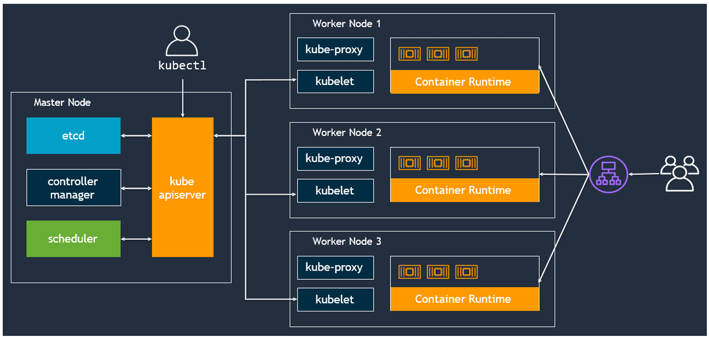
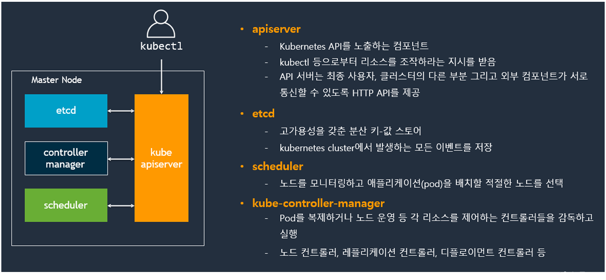
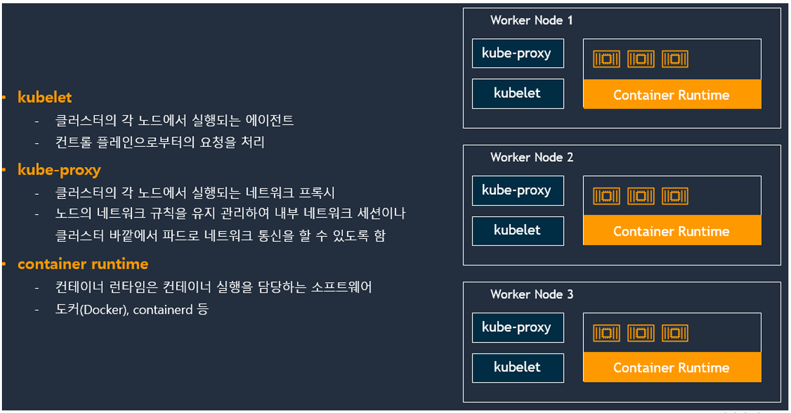

# Kubernetes

## 쿠버네티스 클러스터 아키텍처

## 쿠버네티스 클러스터 내 컨트롤 플레인 구성요소

## 쿠버네티스 클러스터 내 워커노드 구성요소

## 용어
* 클러스터 : 여러 대의 서버(컴퓨터)를 묶어 시스템 하나로 구성하는 방식
* 클러스터링 : 클러스터화
* 쿠버네티스 클러스터 : 컨테이너화된 애플리케이션을 자동으로 배포, 확장 및 관리하기 위해 함께 작동하는 노드(물리적 또는 가상 머신)의 집합
    * 마스터 : 클러스터를 관리(홀수 개로 배치, etcd의 Raft 분산-합의 알고리즘 때문)
    * 노드 : 실제 컨테이너를 실행
* 선언적 API :  원하는 결과만 명시하면 시스템이 알아서 그 결과를 만드는 방식
* 인그레스(진입) : 라우팅 정보를 설정
* 인그레스 컨트롤러 : 인그레스를 읽어 직접적으로 보내는 역할
* kubelet : master의 kube-apiserver와 통신하면서 파드의 생성, 관리, 삭제를 담당
* 어피니티(affinity) : 함께 있어야 하는 pod들을 같은 노드에 실행
* 안티 어피니티(anti-affinity) : pod를 다양한 노드로 분산해서 실행

## 쿠버네티스 주요 컴포넌트

### 마스터용 컴포넌트
* 실제 클러스터 전체를 관리
* etcd
    * 쿠버네티스에 필요한 모든 데이터를 저장하는 데이터베이스
    * 키-값 저장소
    * 서버 하나당 프로세스 1개만 사용 가능
    * 보통 etcd 자체를 클러스터링 한 후 여러 개의 마스터 서버에 분산해서 실행 -> 데이터 안전성 보장
    * 주기적으로 백업 권장
* kube-apiserver
    * 쿠버네티스 클러스터의 API를 사용할 수 있도록 하는 컴포넌트
    * 클러스터로 온 요청이 유효한지 검증
* kube-scheduler
    * 현재 클러스터 안에서 자원 할당이 가능한 노드 중 알맞은 노드를 선택해서 새롭게 만든 pod를 실행
    * 여러가지 조건(하드웨어 요구사항, 어피니티, 안티 어피니티, 특정 데이터가 있는 노드에 할당) 등을 고려
* kube-controller-manager
    * controller 각각을 실행하는 컴포넌트
        * controller : pod들을 관리
        * controller 각각은 논리적으로 개별 프로세스지만, 복잡도를 줄이기 위해 모든 컨트롤러를 바이너리 파일 하나로 컴파일해 단일 프로세스로 실행
    * 새로운 controller를 사용할 때는 controller에 해당하는 구조체를 만들어 manager가 관리하는 queue에 넣어 실행
* cloud-controller-manager
    * 쿠버네티스의 컨트롤러들을 클라우드 서비스와 연결해 관리하는 컴포넌트
    * 관련 컴포넌트의 소스 코드는 각 클라우드 서비스에서 직접 관리
    * 보통 다음 4가지 컨트롤러 컴포넌트를 관리
        * Node Controller : 클라우드 서비스 안에서 노드를 관리
        * Route Controller : 각 클라우드 서비스 안의 네트워크 라우팅을 관리
        * Service Controller : 각 클라우드 서비스에서 제공하는 로드밸런서를 생성, 갱신, 삭제
        * Volume Controller : 클라우드 서비스에서 생성한 볼륨을 노드에 연결하거나 마운트 등

### 노드용 컴포넌트
* kubelet 
    * 클러스터 내 모든 노드에서 실행되는 에이전트
    * pod 내 컨테이너들의 실행을 직접 관리
    * PodSpecs라는 조건이 담긴 설정을 pull받아서 컨테이너를 실행
    * 컨테이너가 정상적으로 실행되는지 health check
    * 노드 안에 있더라도 쿠버네티스가 만들지 않은 컨테이너는 관리 x
* kube-proxy
    * 가상 네트워크의 동작을 관리하는 컴포넌트
    * 호스트의 네트워크 규칙을 관리하거나 연결을 전달
* 컨테이너 런타임
    * 실제로 컨테이너를 실행
    * docker, containerd 등

### 애드온용 컴포넌트(선택)
* 애드온(Add ons)
    * 클러스터 안에서 필요한 기능을 실행하는 pod
    * namespace는 kube-system을 사용
    * 클라우드 서비스에서 제공하는 쿠버네티스를 사용한다면 별도의 네트워킹 애드온을 제공
    * 쿠버네티스를 직접 서버에 구성한다면 네트워킹 관련 애드온을 설치하여 사용해야함(가장 까다로움)

